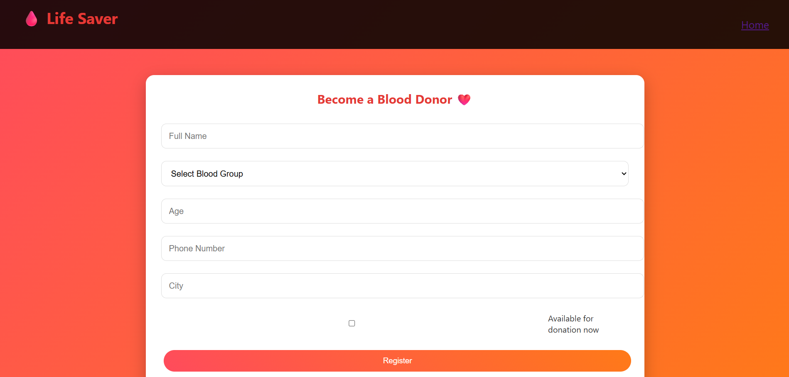
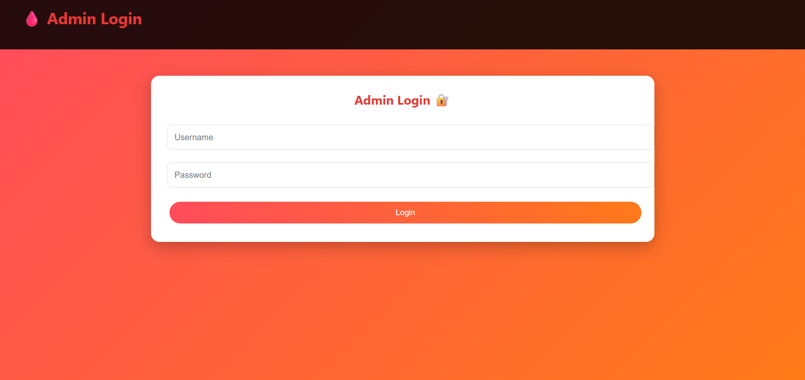
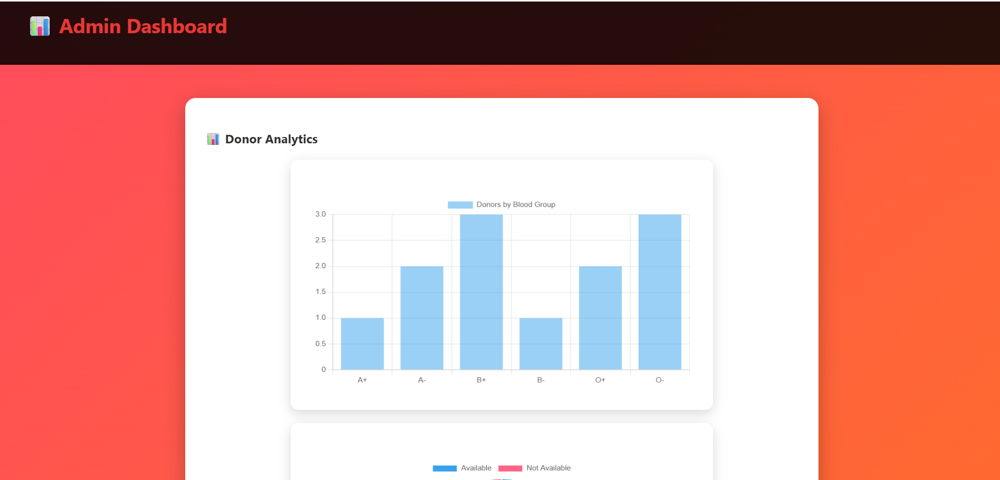

# 🩸 Blood Donation Partner Finder System

A full-stack web application that connects blood donors with patients in real time during emergencies.

## 🚀 Features

- Donor registration
- Search donors by blood group and city
- Admin dashboard
- Emergency broadcast
- Donation tracking
- Analytics charts

## 🛠 Tech Stack

Frontend: HTML, CSS, JavaScript  
Backend: Node.js, Express.js  
Database: MySQL  
Visualization: Chart.js  

## ▶️ How to Run

1. Install dependencies:
   npm install

2. Start server:
   node server.js

3. Open browser:
   http://localhost:3000

   ## 📸 Screenshots

### 🏠 Home Page

### 📝 Donor Registration Page

### 🔎 Donor Finder Page

### 🔐 Admin Login Page

### 📊 Admin Analytical Dashboard

### 🧾 Donation Records Page

## 🌐 Deployment

Demonstrated using Ngrok for public access.

## 👨‍💻 Author

Vinay Reddy
